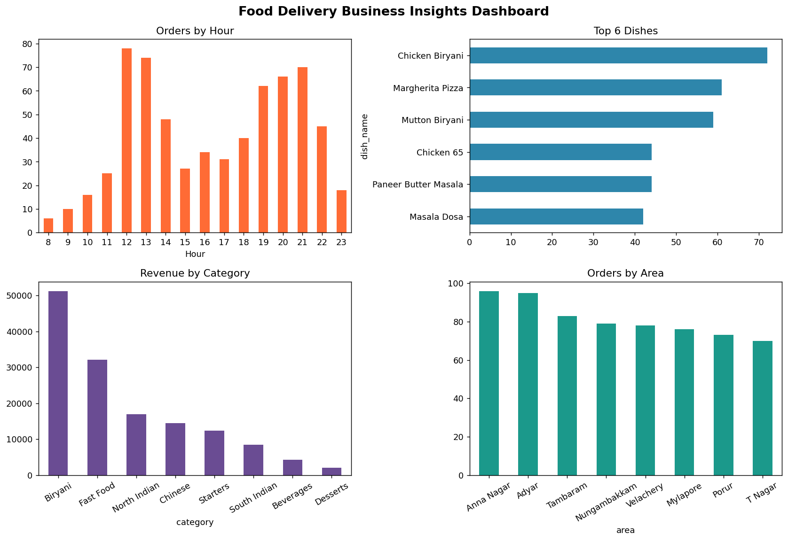

# Food Delivery Sales & Customer Insights

Exploratory data analysis of food delivery order data using Python, built as part of the **Naan Mudhalvan Arts Internship Program 2026 — Python for Data Analytics**.

## Project Overview

A food delivery company wants to understand customer ordering patterns and identify its most popular food items, in order to improve operational planning — staffing during peak hours, promoting high-margin dishes, and allocating delivery partners across zones.

This project analyzes a sample order log (650+ orders over a 90-day window, across 8 delivery zones) to answer:

- When do customers order the most? (peak order times)
- What are the most popular dishes?
- Which delivery areas generate the most orders?
- Which food categories generate the most revenue?
- How do customers prefer to pay?

## Tools & Libraries

| Library | Purpose |
|---|---|
| **Pandas** | Loading, cleaning, and aggregating order data |
| **NumPy** | Numerical operations and synthetic data generation |
| **Matplotlib** | Bar charts, pie charts, and the combined dashboard |

## Repository Structure

## Key Insights

- Orders peak around **lunch (12–1 PM)** and **dinner (7–9 PM)**, a classic bimodal food-delivery demand pattern.
- **Chicken Biryani** is the best-selling dish, and **Biryani as a category drives the largest share of revenue**.
- Order volume is fairly balanced across delivery zones, with **Anna Nagar and Adyar** slightly ahead.
- **UPI** is the most-used payment method, ahead of cards, cash on delivery, and wallets.
- Average delivery time is **~36 minutes** with an average customer rating of **~4.4 / 5**.

## How to Run

1. Clone or download this repository.
2. Install dependencies: `pip install -r requirements.txt`
3. Open `Food_Delivery_Sales_Analysis.ipynb` in Jupyter Notebook or Google Colab.
4. Run all cells from top to bottom.

## Author

[HARIHARA RUTHRAN V ] — Naan Mudhalvan Arts Internship Program 2026
